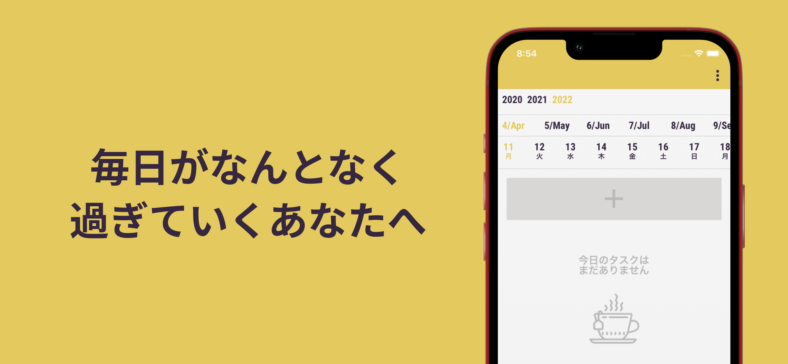

# memoir

[](https://ko-fi.com/K3K5E9FLI)

終わったタスク、積み上げよう。1 週間を振り返るアプリ。

<div style="display:flex">
    
    
</div>
<div style="display:flex">
    
    
</div>

## 各リポジトリのリンク

| リポジトリ内容   | URL                                                |
| ---------------- | -------------------------------------------------- |
| アプリ           | https://github.com/wheatandcat/memoir              |
| バックエンド     | https://github.com/wheatandcat/memoir-backend      |
| LP サイト        | https://github.com/wheatandcat/memoir-lp           |
| 開発ドキュメント | https://github.com/wheatandcat/memoir-handbook     |
| Push 通知        | https://github.com/wheatandcat/memoir-notification |
| ツール系         | https://github.com/wheatandcat/memoir-tools        |

## 使用技術/デザインのリンク

## 技術

- [Expo](https://expo.io/)
- [React Native](https://reactnative.dev/)

## デザイン

- Font by Roboto Condensed & Noto Sans JP
- Icons by [Icons8](https://icons8.jp/)

# コマンド

## 診断

```bash
$ npx expo-doctor
```


## Android


### ローカル起動

```bash
$ pnpm dev:android
```

### productionビルド

```bash
$ pnpm android:build
```

## iOS

### ローカル起動バージョンアップ後の初回

```bash
$ pnpm ios:build:dev
```

### ローカル起動

```bash
$ pnpm dev:ios
```

### productionビルド

```bash
$ pnpm ios:build
```

## iOS/Android ビルド & ストアアップロード


```bash
$ pnpm store:upload
```

## Storybook

### iOS起動

```bash
$ pnpm storybook:ios
```

### Android起動

```bash
$ pnpm storybook:android
```

# コード生成

## 新規画面作成

```bash
$ pnpm hygen page new
```

## コンポーネント作成

```bash
$ pnpm hygen component new
```

## テストコード追加

```bash
$ pnpm hygen test new
```

# ライセンスの出力

```bash
$ npx npm-license-crawler --dependencies --production --onlyDirectDependencies --omitVersion --json ./src/licenses.json
```

# CI 環境

## レビュー環境

### アプリ内コンフィグ

```bash
$ base64 -i .env.development | pbcopy
```

## 本番環境

### アプリ内コンフィグ

```bash
$ base64 -i .env.production | pbcopy
```
