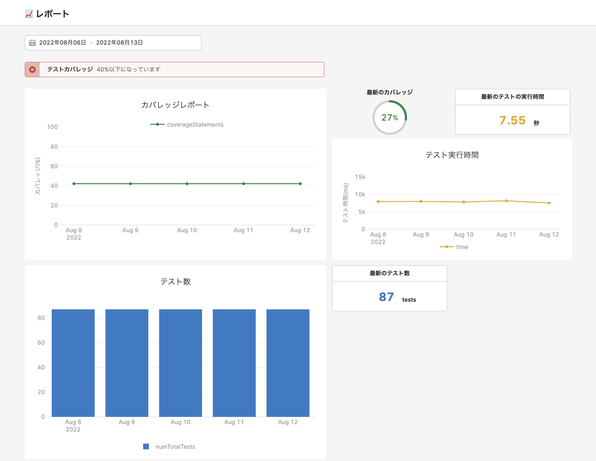

# メトリクスを送信する

[ダッシュボード](https://jurassic.retool.com/embedded/public/ca1843e7-ce2b-41ad-92c1-1ca7ff8cd944)

<div style="display:flex">
    
</div>

## 実行

```bash
$ yarn send
```

# CI環境

```bash
$ base64 -i ./serviceAccount.json | pbcopy
```